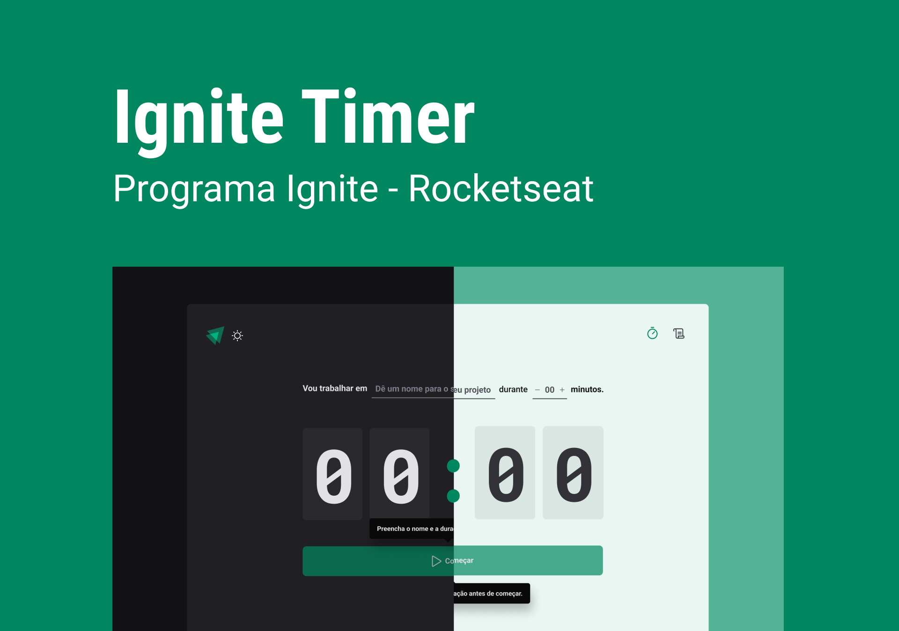

<h1>
    
    Ignite Timer
</h1>

 <a href="#-technologies">Technologies</a> |
 <a href="#-deploy">Deploy</a> |
 <a href="#-layout">Layout</a> |
 <a href="#-clipboard-pré-requisitos">Clipboard</a> |
 <a href="#-settings">Settings</a>

---

O Ignite Timer nada mais é que um projeto que permite ao usuário cronometrar as suas tarefas no dia a dia, 
além de le permite ver um histórico de todos as tarefas já realizadas.

**Objetivos**: os principais objetivos desta aplicação foi treinar a atilização das seguintes ferramentas/tecnologias: 
  - Lidar com datas e horarios através da biblioteca `date-fns`
  - Utilização de formulários com `React Hook Form`
  - Aplicação de temas dark e light utilizando o `Styled Components`
  - Uso do hook `useReducer` do React para centralizar as alterações em um estado complexo
  
## 💻 Deploy

Clique no link a seguir para executar o projeto na sua máquina: <a target="_blank" href="https://pomodoro-timer-rose-pi.vercel.app">Link</a>

## 🚀 Technologies

Esse projeto foi desenvolvido com as seguintes tecnologias:

✔ [Vite](https://vitejs.dev/)
 
✔ [ReactJS](https://reactjs.org/)
 
✔ [TypeScript](https://www.typescriptlang.org/)
 
✔ [Styled Components](https://styled-components.com/docs)
 
✔ [Phosphor Icons](https://phosphoricons.com/)
 
✔ [date-fns](https://date-fns.org/docs/Getting-Started)
 
✔ [React Hook Form](https://react-hook-form.com/)
 
✔ [Zod](https://github.com/colinhacks/zod)
 
✔ [React Router](https://reactrouter.com/en/v6.3.0/getting-started/overview)
 
✔ [Immer](https://github.com/immerjs/immer)
 

## 🎨 Layout

Você pode visualizar o layout do projeto através [desse link](https://www.figma.com/file/w4kGeggQGODxz9LXKUBgSo/Ignite-Timer-(Community)?node-id=2-12&t=WDaK9NrLdV9gtnLk-0). É necessário ter conta no [Figma]([https://www.figma.com/](https://www.figma.com/design/w4kGeggQGODxz9LXKUBgSo/Ignite-Timer-(Community)?node-id=0-1&p=f&t=tHpMk1xfvDEWwbey-0)) para acessá-lo.

    

## 📋 Clipboard (Pré-requisitos)

Antes de baixar o projeto você vai precisar ter instalado na sua máquina as seguintes ferramentas:

* [Git](https://git-scm.com)
* [NodeJS](https://nodejs.org/en/)
* [Yarn](https://yarnpkg.com/) ou [NPM](https://www.npmjs.com/)

## ⚙ Settings

Segue os comandos para baixar e executar o projeto na sua máquina:

* `git clone` + `URL do Projeto`: clonar este repositório.
* `npm install`: para baixar as dependências do projeto dentro do diretório.
* `npm run dev`: 
    - Executa o projeto em modo/ambiente de desenvolvimento.
    - Abra [http://localhost:3000](http://localhost:3000) para ver o projeto rodando no Navegador.
    - A página será recarregada se você fizer edições no código, e se tiver algum erro será mostrado no console.
* `npm build`: 
    - Compila a aplicação para a produção na pasta `build`.

## 📝 License

Esse projeto está sob a licença MIT. Veja o arquivo [LICENSE](LICENSE) para mais detalhes.
